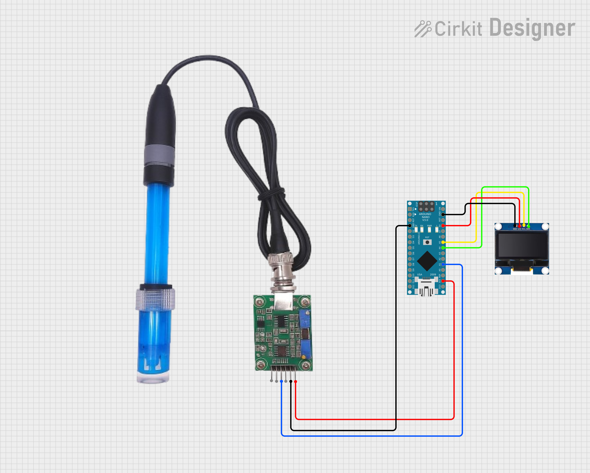
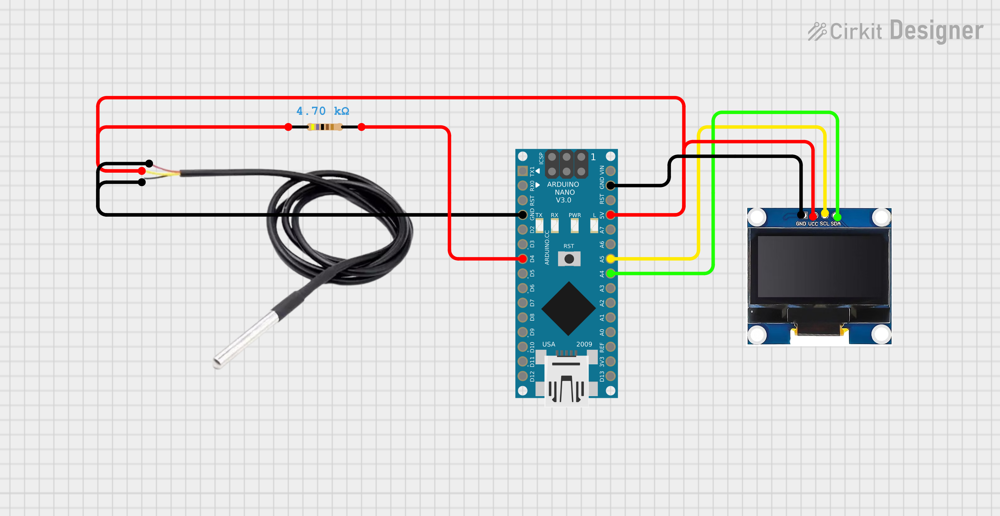
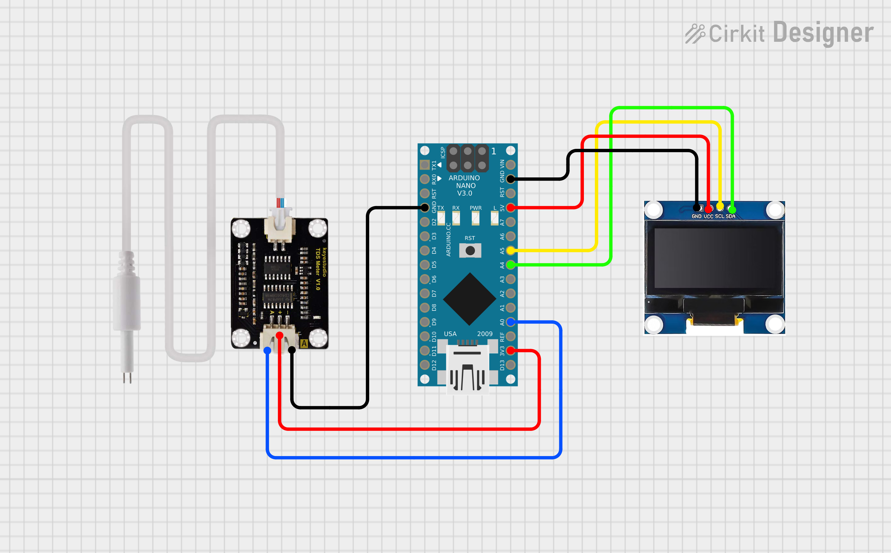

# Embedded_System_Midterms

This repository contains Arduino-based programs for testing and integrating different water quality sensors, including the **pH Sensor**, **TDS Sensor**, and **DS18B20 Temperature Sensor**.

## 📘 Sensor References

### 🔹 pH Sensor
- **Description:** Used to measure the acidity or alkalinity of a solution.
- **Reference:**  
  [How to Interface pH Sensor with Arduino](https://circuitdigest.com/microcontroller-projects/arduino-ph-meter)
- **Schematic:**  
    
  *Example: pH sensor connection with Arduino Nano*
    
  *Example: pH sensor connection with Arduino Nano and OLED Display*

### 🔹 DS18B20 Temperature Sensor
- **Description:** A digital temperature sensor that communicates using the 1-Wire protocol.
- **Reference:**  
  [Arduino - DS18B20 Temperature Sensor Tutorial](https://randomnerdtutorials.com/esp32-ds18b20-temperature-arduino-ide/)
- **Schematic:**  
    
  *Example: DS18B20 wiring with Arduino and 4.7kΩ pull-up resistor*
    
  *Example: DS18B20 wiring with Arduino and 4.7kΩ pull-up resistor (OLED Display)*

### 🔹 TDS Sensor
- **Description:** Measures Total Dissolved Solids (TDS) in water to assess its purity level.
- **Reference:**  
  [How to Interface TDS Sensor with Arduino](https://randomnerdtutorials.com/arduino-tds-water-quality-sensor/)
- **Schematic:**  
    
  *Example: TDS sensor connected to Arduino analog input*
    
  *Example: TDS sensor connected to Arduino analog input with OLED Display*

---

## 🗂️ File Descriptions

### 📁 midterm Folder  
Contains all source code and custom libraries for each individual water quality sensor.

| File | Description |
|------|-------------|
| **Tds_Sensor.cpp** | Implements logic for reading and processing TDS sensor values, including EC and PPM conversion. |
| **Tds_Sensor.h** | Header file declaring functions and variables for the TDS sensor library. |
| **Tds_Sensor.ino** | Arduino test sketch for TDS sensor. Handles setup, loop, and serial/LCD display output. |
| **Temperature_Sensor.cpp** | Contains DS18B20 sensor logic using OneWire/DallasTemperature libraries to read temperature. |
| **Temperature_Sensor.h** | Header file for DS18B20 sensor, declaring sensor functions and objects. |
| **Temperature_Sensor.ino** | Arduino sketch for testing DS18B20 temperature readings. Displays output on Serial/LCD. |
| **pH_Sensor.cpp** | Implements pH sensor logic, including signal filtering, calibration, and value calculation. |
| **pH_Sensor.h** | Header file for pH sensor, containing function and variable declarations. |
| **pH_Sensor.ino** | Arduino sketch to test pH sensor, includes calibration and reading display. |
| **config.h** | Configuration file for shared settings such as pins, calibration constants, and voltage reference. |

---
