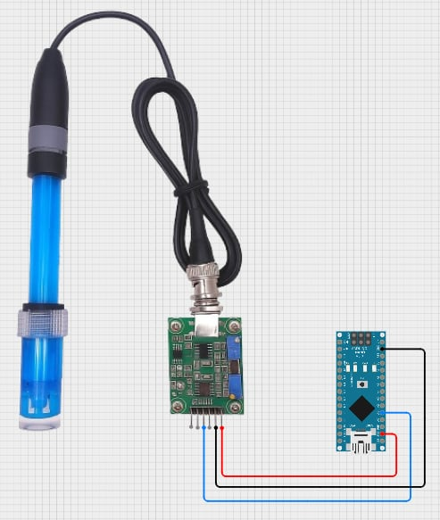
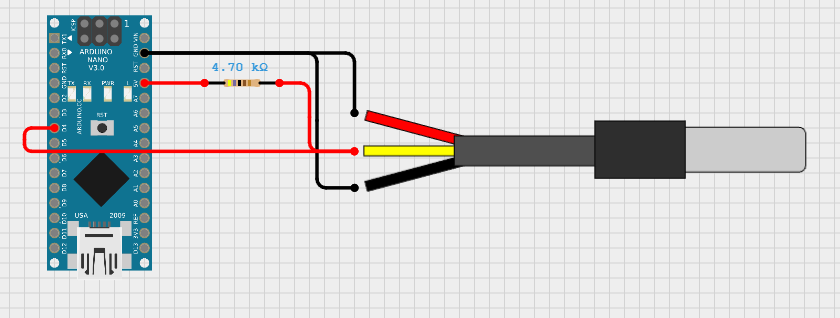
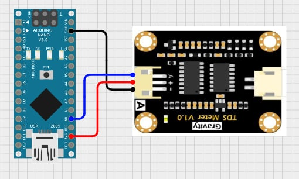

# Embedded_System_Midterms

This repository contains Arduino-based programs for testing and integrating different water quality sensors, including the **pH Sensor**, **TDS Sensor**, and **DS18B20 Temperature Sensor**.

## 📘 Sensor References

### 🔹 pH Sensor
- **Description:** Used to measure the acidity or alkalinity of a solution.
- **Reference:**  
  [How to Interface pH Sensor with Arduino](https://circuitdigest.com/microcontroller-projects/arduino-ph-meter)
- **Schematic:**  
    
  *Example: pH sensor connection with Arduino Nano*

### 🔹 DS18B20 Temperature Sensor
- **Description:** A digital temperature sensor that communicates using the 1-Wire protocol.
- **Reference:**  
  [Arduino - DS18B20 Temperature Sensor Tutorial](https://randomnerdtutorials.com/esp32-ds18b20-temperature-arduino-ide/)
- **Schematic:**  
    
  *Example: DS18B20 wiring with Arduino and 4.7kΩ pull-up resistor*

### 🔹 TDS Sensor
- **Description:** Measures Total Dissolved Solids (TDS) in water to assess its purity level.
- **Reference:**  
  [How to Interface TDS Sensor with Arduino](https://randomnerdtutorials.com/arduino-tds-water-quality-sensor/)
- **Schematic:**  
    
  *Example: TDS sensor connected to Arduino analog input*

---
